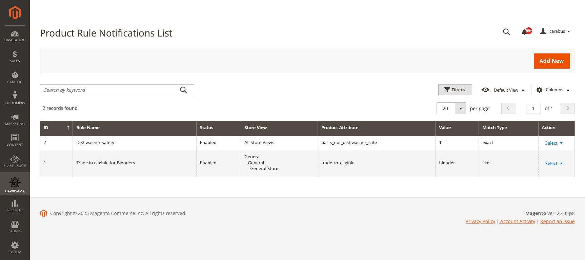
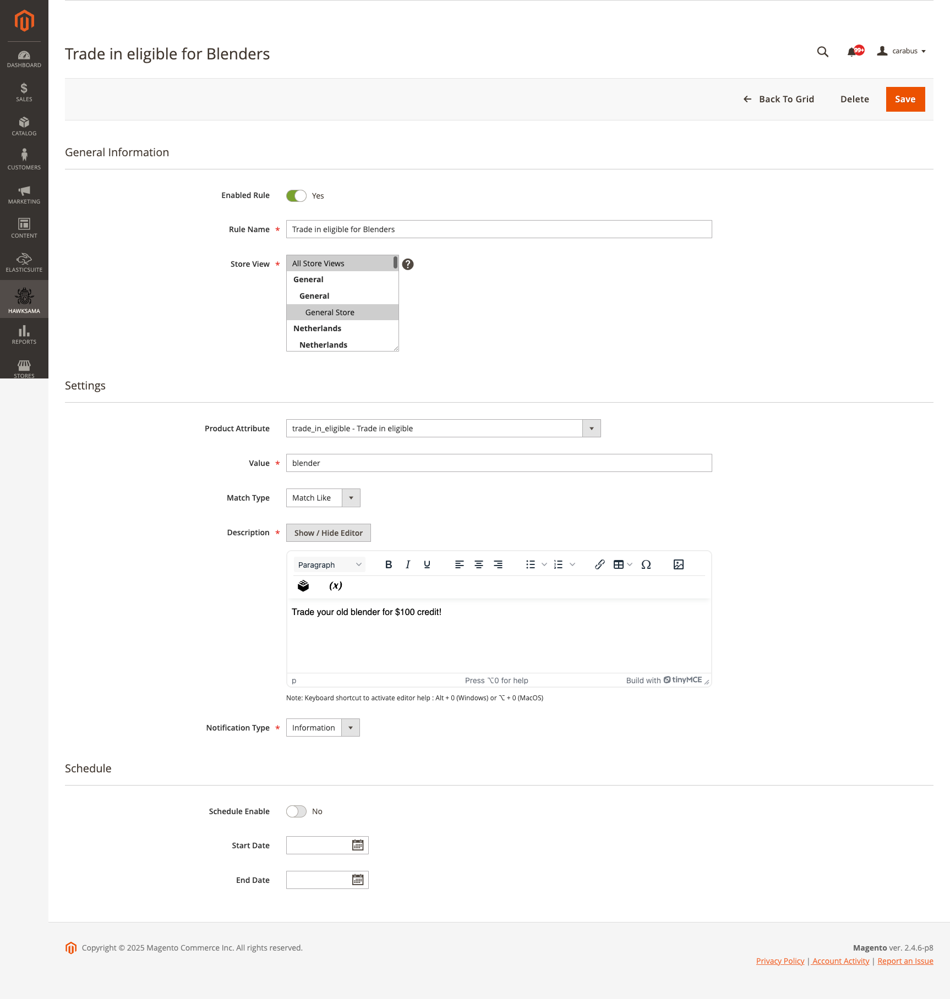
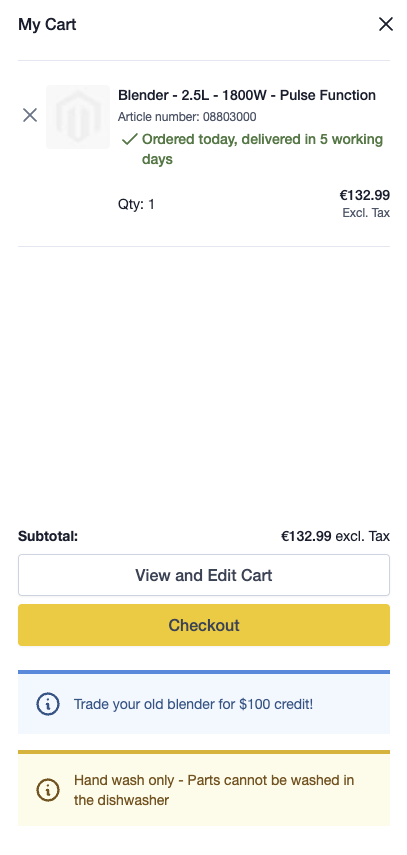
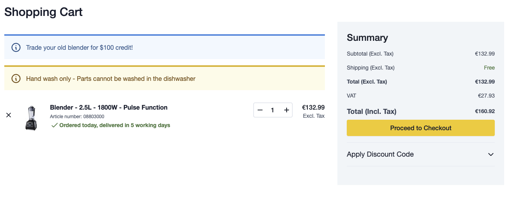
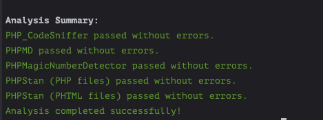

# Hyva Product Attribute Notifications for Magento 2

A dynamic Magento 2 module designed for **Hyva Themes** that displays targeted notifications in the minicart and cart pages based on product attributes. Perfect for creating urgency, highlighting promotions, and enhancing customer experience.

---

## 🌟 Overview

This module empowers merchants to create **customizable notification rules** that trigger contextual messages (ERROR, WARNING, INFORMATION, SUCCESS) when products with specific attributes are added to the cart. Features include:

- **Multi-store support**
- **Scheduled activation** (start/end dates)
- **Attribute value matching** (exact match or contains)
- **AlpineJS-driven logic** for seamless Hyva integration
- **Admin UI Grid & Form** for easy rule management

---

## 🚀 Key Features

| Feature | Description |
|---------|-------------|
| **4 Notification Types** | ERROR, WARNING, INFORMATION, SUCCESS with customizable styling |
| **Advanced Attribute Targeting** | Match attributes by exact value or partial text |
| **Time-Based Rules** | Schedule notifications for specific periods |
| **Multi-Store Ready** | Configure rules per store view |
| **Frontend Display** | Notifications in minicart and cart page |
|**Dynamic Updates** |	Notifications in the minicart dynamically update based on cart changes, ensuring users always see relevant information without needing to refresh the page.|
| **Code Quality** | Passes PHPStan, PHPMD, PHP_CodeSniffer, and more |

---

## ⚙️ Configuration

1. **Navigate to Admin Panel**:  
   `Hawksama → Product Notifications → Manage Rules`
2. **Create New Rule**:
    - Define attribute conditions based on your product attributes.  
      This module supports two match types:
        - **Exact Match**: Matches the attribute value exactly.
            - Example: `certification = "organic"`  
              This triggers a notification for products certified as "organic".
        - **Substring Match (LIKE)**: Matches if the attribute value contains the specified substring.
            - Example: `description LIKE "recycled"`  
              This triggers a notification for products with "recycled" anywhere in their description.

    - **For Boolean Attributes**:
        - Use `true` or `false` for attributes stored as boolean values.
        - Supported values:
            - **True Values**: `"1"`, `"true"`, `"on"`, `"yes"`
            - **False Values**: `"0"`, `"false"`, `"off"`, `"no"`
        - Example:
            - `is_backorder = "true"` triggers a notification when the product is on backorder.
    - Select notification type and content.
    - Set schedule (optional).
    - Assign to store views.
3. **Frontend Display**:  
   Notifications automatically appear in the Hyva minicart and cart page.te

---

## 🛠 Use Cases

### 🎯 Promotions & Sales
- **Flash Sales**: `flash_sale = "active"`  
  `SUCCESS: "24-Hour Flash Sale! 30% OFF!"`
- **Bundle Deals**: `is_part_of_bundle = "yes"`  
  `INFORMATION: "Save $20 when purchased in a bundle!"`

### 📦 Inventory Management
- **Low Stock**: `stock_status <= 10`  
  `WARNING: "Only 3 left in stock!"`
- **Backorders**: `is_backorder = "true"`  
  `INFORMATION: "Ships in 7-10 business days."`

### 🌱 Product Insights
- **Eco-Friendly**: `eco_friendly = "yes"`  
  `SUCCESS: "Made from 100% recycled materials!"`
- **Certifications**: `certification = "organic"`  
  `INFORMATION: "USDA Organic Certified"`

**[Explore 25+ Advanced Use Cases](USE_CASES.md)**

---

## 📸 Screenshots

### Admin Rule Management
| GRID View                              | Form View                              |
|----------------------------------------|----------------------------------------|
|  |  |

### Frontend Display
| Minicart Notifications             | Cart Page Notifications    |
|------------------------------------|----------------------------|
|  |  |

---

## 🧰 Technical Details

- **Compatibility**: Magento 2.4.x / Hyva Themes
- **Frontend Logic**: AlpineJS integration for reactive notifications
- **Code Quality**:  
  ✅ PHPStan (Level 8)  
  ✅ PHPMD  
  ✅ PHP_CodeSniffer (Magento Coding Standard)  
  ✅ PHP Magic Number Detector
  

I used https://github.com/Hawksama/docker-magento/blob/master/compose/bin/analyse used to validate code quality and detect potential issues.

---

## ❓ FAQ

❓ **How are notifications triggered?**  
When cart items match attribute rules (exact match or partial text).

❓ **Can I restrict rules to specific stores?**  
Yes – multi-store configuration is supported.

❓ **What happens if multiple rules apply?**  
All matching notifications are displayed (ERROR > WARNING > INFO > SUCCESS).

❓ **Is Hyva required?**  
Yes – built specifically for Hyva's AlpineJS framework.

---

## 📮 Support & Contribution

- **Issues**: [GitHub Issue Tracker](https://github.com/Hawksama/HyvaProductRuleNotifier/issues)
- **Contact**: manue971@icloud.com
- **Contribution**: PRs welcome! Follow [Magento Coding Standards](https://developer.adobe.com/commerce/php/coding-standards/).

---

💡 **Transform your cart experience with contextual, actionable notifications!**
